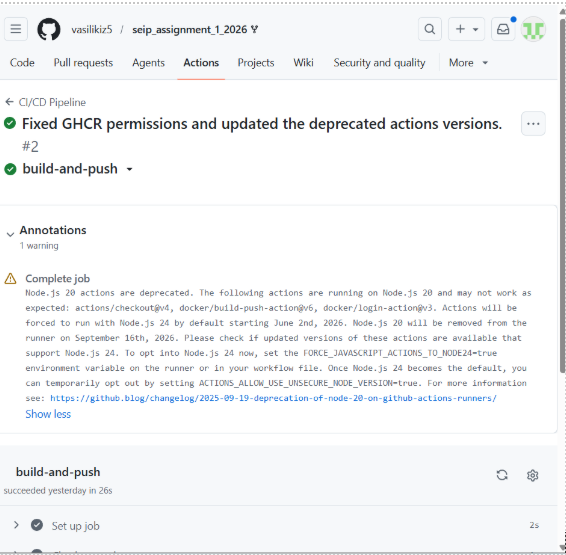
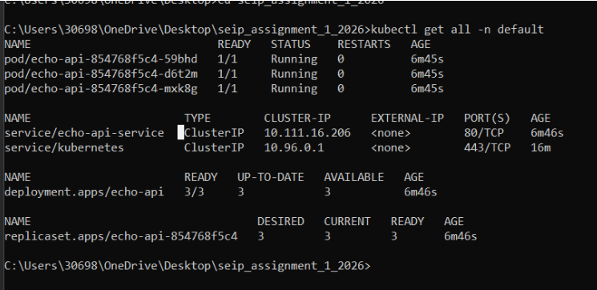
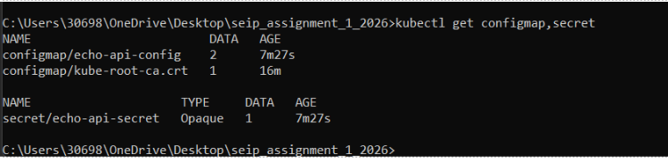
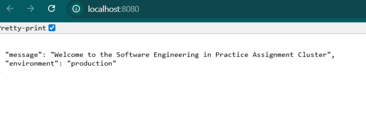
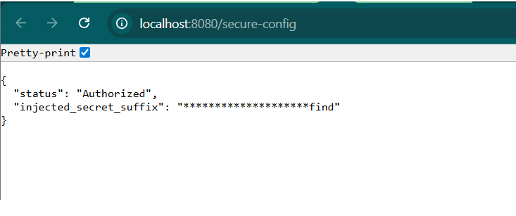
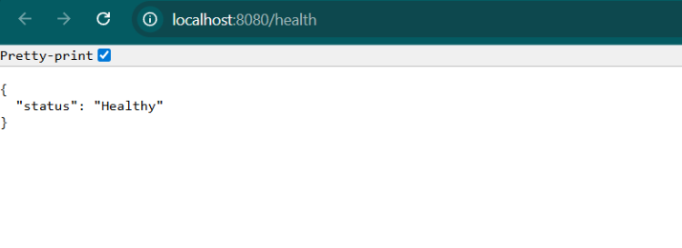

# Software Engineering in Practice – Assignment 1

**Vasiliki Zagoraiou**
**8230036**

---

## GitHub Repository Link

https://github.com/vasilikiz5/seip_assignment_1_2026

---

## CI/CD Proof

The GitHub Actions CI/CD pipeline successfully builds and pushes the Docker image to GHCR on every push to the main branch.

---

## Cluster State Proof

The Kubernetes cluster is running with three healthy pods, the deployment and the ClusterIP service.

**kubectl get all -n default:**

**kubectl get configmap,secret:**

---

## Application Verification

The application endpoints respond correctly with the injected ConfigMap and Secret values.

**Root endpoint (/):**

**Secure config endpoint (/secure-config):**

**Health endpoint (/health):**

---

## AI Reflection & Future Outlook

### AI Integration

I used Claude to help me understand how Kubernetes works, how YAML syntax is formed and how to overcome some errors I encountered during the setup process.

### Utility Analysis

The AI was helpful for:

- Explaining error messages from GitHub Actions and Minikube
- Quickly identifying syntax issues in YAML files
- Understanding the Base64 encoding process and the newline pitfall when creating Secrets
- Clarifying the relationship between Kubernetes components fast

### Friction Points

The initial GitHub Actions workflow was missing the permissions block for GHCR, which caused the pipeline to fail. I had to add "packages: write" to fix it.

Minikube defaulted to the VirtualBox driver instead of Docker, requiring to manually specify "--driver=docker".

Docker Desktop could not start because I had previously disabled WSL2 and Virtual Machine Platform in order to run Oracle VirtualBox for another course. These two Windows features conflict with VirtualBox, so I had to re-enable them and restart my machine before Docker Desktop would launch.

### Future Architectural Outlook

If I had more time or needed to scale this project for a real production environment, the first thing I would change is replacing port-forwarding with an Ingress Controller like NGINX, since port-forward is only meant for local testing and not for actual users to access the application.

I would also look into setting up ArgoCD for GitOps, so that every time I push changes to GitHub, the Kubernetes cluster updates itself automatically without me having to run kubectl commands manually.

On the security side, I would integrate an image scanner like Trivy into the CI pipeline to catch vulnerabilities in the Docker image before it even gets deployed.

Finally, right now the deployment always runs exactly 3 pods regardless of traffic. A Horizontal Pod Autoscaler would automatically scale the number of pods up or down based on actual demand, which is both more efficient and more realistic for production use.
